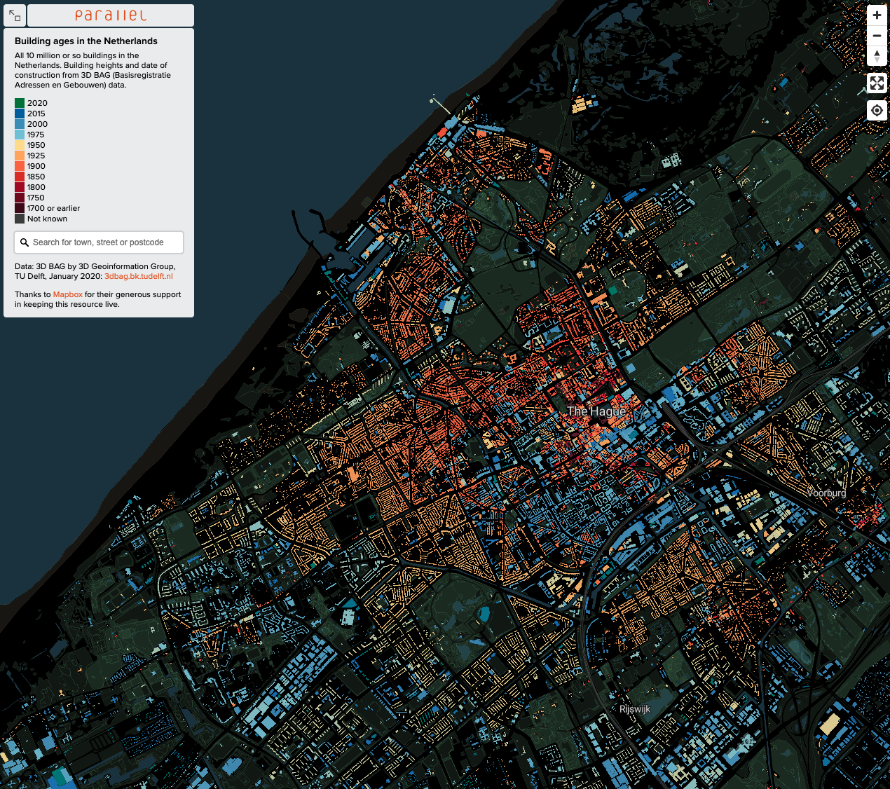

# Project

# Understanding urban texture over time - Comparing Neighborhoods of The Hague

### S Bhamidipati

#### 4th March 2021

# Part 2

### Data Acquired

In this section, we described the data used  and preparation of the dataset used in this project. 

- **Neighborhood data**: A neighborhood in Netherlands is known as a wijk, which roughly translates to a district. We collected this data from the City office website on this [link](https://denhaag.dataplatform.nl/#/home) . These are polygons and we use QGIS to calculate the centroids of each districts. This data has no additional information than just holding the latitude and longitude values. We have discarded all other information as it is not relevant for our project. 
  - Data Source: https://denhaag.dataplatform.nl/#/home
  - Extra Tools used: https://www.qgis.org/en/site/
  - The data is in Dutch language and therefore is not presented here. We have simplified the data and kept only three fields: City Name, Neighborhood Name, Latitude and Longitude
  - The Hague has 46 districts, the centroids of which are shown in the image below.
  - This data is stored in a csv

- **Buildings data**:  This data shows the age of each building in the Hague, we could not get the raw data, but the visualization of the data can be see on this [link](https://parallel.co.uk/netherlands/#12.34/52.07984/4.28223). We will be using this data to validate our results to show if age of a neighborhood affects the activities and venues in the neighborhood. see Image below. 
  - Data Source:  https://parallel.co.uk/netherlands/#12.34/52.07984/4.28223

- **Four Square data**: As prescribed by the project instructions, we will be using Four Square API to collect information on activity venues in all the districts of Hague.  Please see this [link](https://developer.foursquare.com/). 

  - We requested this API to provide locational information on 100 venues within a given radius of 1000m.
- This data is pulled via a python request and is not stored locally.
  
  

