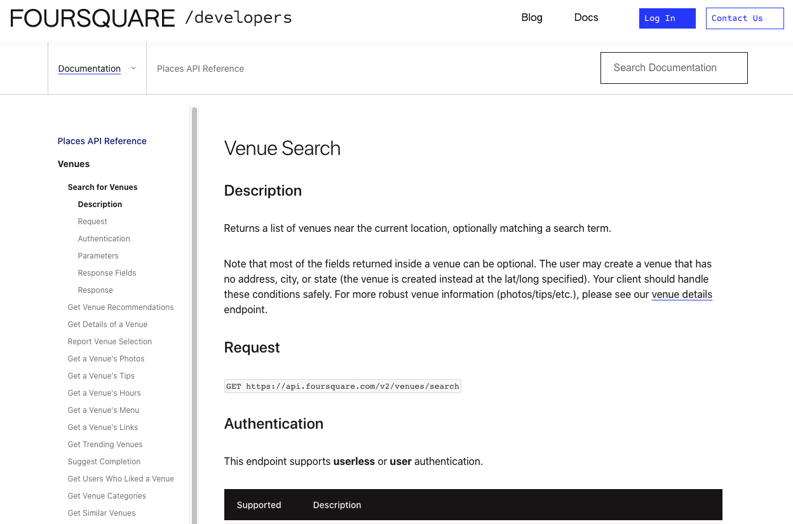

# Title: Understanding urban texture over time - Comparing Neighborhoods of The Hague

#### 

[TOC]

#### 

# Part 1

### Introduction 

The Hague, in Netherlands is one of the oldest cities in Netherlands and the government of Netherlands and its parliaments works from this city. Most parts of the current Hague was under sea few centuries ago and land was slowly reclaimed from the sea. Hague forms one of the three major cities: Amsterdam, Rotterdam, Hague which form the Randstad region of Netherlands. Hague is on the west coast of Netherlands separated from the UK by the North Sea. Hague despite being an old city, is also very modern and multi-cultural with many international institutions and multi-national companies (see images). This mix of old and new urban developments give the city a good contrast amongst its neighborhoods . 

<u>Picture showing contrast in old and new architecture  in the city of Hague.</u>

### Problem Statement & Hypothesis

In this project, we will study and compare neighborhoods of Hague, The Netherlands. We will investigate if urban spread or sprawl over time, affects the composition of activities and texture of the urban fabric. For example, urban developments plans 30 years ago are not the same as now and will not be same 30 years later. The density of buildings, the landuse (mixed or segregated), composition of landuses depends on needs of the time. 

To understand more clearly, we wish to investigate if urban venues and their type, and their density differs over space and time.  Our hypothesis is yes, urban density, development  and land use depends on time, therefore the density of venues and type of venues we will be collecting from Foursquare should show this differences.

If our hypothesis is true, the clusters should show circular patterns as can be seen in the image below, which is an actual ground reality of 2021. This picture shows the color of buildings based on their age. The color range goes from hot-to-cold or red-to-blue. Red color shows the oldest part of the city while the blue color shows the new developments. Orange colors in between, are middle aged buildings. 

# Part 2

### Data Acquired

In this section, we described the data used  and preparation of the dataset used in this project. 

- **Neighborhood data**: A neighborhood in Netherlands is known as a wijk, which roughly translates to a district. We collected this data from the City office website on this [link](https://denhaag.dataplatform.nl/#/home) . These are polygons and we use QGIS to calculate the centroids of each districts. This data has no additional information than just holding the latitude and longitude values. We have discarded all other information as it is not relevant for our project. 
  - Data Source: https://denhaag.dataplatform.nl/#/home
  - Extra Tools used: https://www.qgis.org/en/site/
  - The data is in Dutch language and therefore is not presented here. We have simplified the data and kept only three fields: City Name, Neighborhood Name, Latitude and Longitude
  - The Hague has 46 districts, the centroids of which are shown in the image below.
  - This data is stored in a csv

- **Buildings data**:  This data shows the age of each building in the Hague, we could not get the raw data, but the visualization of the data can be see on this [link](https://parallel.co.uk/netherlands/#12.34/52.07984/4.28223). We will be using this data to validate our results to show if age of a neighborhood affects the activities and venues in the neighborhood. see Image below. 
  - Data Source:  https://parallel.co.uk/netherlands/#12.34/52.07984/4.28223

- **Four Square data**: As prescribed by the project instructions, we will be using Four Square API to collect information on activity venues in all the districts of Hague.  Please see this [link](https://developer.foursquare.com/). 

  - We requested this API to provide locational information on 100 venues within a given radius of 1000m.

- This data is pulled via a python request and is not stored locally.

  

# Part 3

## Methodology 

We will be following the methodology as listed in these steps

- collect and prepare data from **different sources**
  - collect neighborhood data from the local government website
  - collect venue information from the **Foursquare API**
  - collect existing landuse data and construction history of the city from opensource data 
- all the data has a common field, neighborhood/district name, so we can **combine them** into a big data base for our analysis
- we will explore this data with some **descriptive statistics** like frequency, tally counts along with maps
- we will then prepare the data for cluster analysis using **one-hot encoding** method. 
- among different clustering algorithms, we will use **K-means clustering algorithm**
- we will then calculate the appropriate number of clusters according to the **elbow plot**
- and finally make observations and **conclusions**

## Exploratory Data Analysis

In this section, we will explore the data collected from Foursquare. A Foursquare call was sent with the following parameters:

- LIMIT: 100
- radius: 1000m
- The Foursquare API call for our 46 neighborhoods (districts) returned 2125 Venues. A sample top 5 rows are shown here:

###  Cleaning received data

The data received from the API had some special characters and duplication especially with the restaurant category. A small function is used to clean this category and to aggregate venues of same category.

###  Unique & frequent venue categories

After the cleaning, we tabulate the venue category to find unique and frequent categories. We notice that there are 189 unique categories in our data from Foursquare, the most popular and frequent among them are restaurants. 

###  Most omnipresent venue category

Here we try to see how each venue category is spread in each neighborhood (district) of Hague. For example, as we can see from the graph below, restaurants and supermarkets are available in almost 40 of the 46 neighborhoods. Or we can say, that people have access to supermarkets within a Kilometer of their residence. 

### Top Neighborhoods (districts) with most venues

From this data we can also extract which neighborhood has most venues in them or within 1 Km. We see from the graph below that the top 5 neighborhoods (districts) have 100 venues. We must be aware that we had set our limit to 100 in our query, so these 5 districts have reached their maximum query limit. 

We have mapped these 5 districts and we notice that they are right in the center of the city and 1 of them on the beach which is a very popular beach in entire Netherlands. So the results appear to show reality.

## Preparation for Cluster Analysis

### Feature Selection

The purpose of the clustering is to group neighborhoods based on similarity among venue categories. Two most important features therefore are “District” and “Venue Category”. However we have to convert these to numeric values because the algorithm works with numerical features.

### Preparing for one-hot encoding

In order to prepare for the cluster analysis, we have to encode each of the 189 category into a binary value combination such that each combination falls into one category. This would also require us to regroup the data based on neighborhood (district).  We show here a sample of the resulting one-hot enconding operation.

### Suitable Number of Clusters

One of the pitfalls of clustering algorithms are that with increase in number of clusters, the error reduces. However, large number of clusters is a kind of overfitting and should be avoided. The correct number of clusters for an analysis can be chosen using the elbow plot. To generate this plot, we run Kmeans algorithm with a given range of clusters and select a number where the rate of change of reduction in error becomes less sharp. The elbow plot for this analysis is shown in the figure below.

![img](data:image/png;base64,iVBORw0KGgoAAAANSUhEUgAAAYIAAAEGCAYAAABo25JHAAAAOXRFWHRTb2Z0d2FyZQBNYXRwbG90bGliIHZlcnNpb24zLjMuNCwgaHR0cHM6Ly9tYXRwbG90bGliLm9yZy8QVMy6AAAACXBIWXMAAAsTAAALEwEAmpwYAAAnLklEQVR4nO3dd3yV9d3/8dcngxEIgZCwQiBhg2AAGU4Et9Di/tVRvWsHrjpqbW29e9+9e3dpW61aVx3V9q5ibbUV96gCLjYJG2QECDMQwgoQknx+f5wDpDQkBHNxneS8n49HHp6T6zrXeR9KeZ9rfL+XuTsiIhK/EsIOICIi4VIRiIjEORWBiEicUxGIiMQ5FYGISJxLCjtAfWVkZHhOTk7YMUREGpXZs2dvcffMmpY1uiLIyclh1qxZYccQEWlUzGz1kZbp0JCISJxTEYiIxDkVgYhInFMRiIjEORWBiEicUxGIiMQ5FYGISJyLmyJYW1LGT15byP7KqrCjiIjElLgpgqUbd/LsJ4VMnLEm7CgiIjElborg7P4dOLlHOg++/zk79u4PO46ISMyImyIwM/5z7ABKdpfzxOQVYccREYkZcVMEAIO6pnHJkCye+XgV60r3hB1HRCQmxFURANx1fl8cuP+dpWFHERGJCXFXBFltW/L103J5Ze46FqzbHnYcEZHQxV0RANw8piftUpL52RuLcPew44iIhCoui6BNi2TuOKcP01aW8MGSzWHHEREJVVwWAcDVI7uRm9GKX7y5mAoNMhOROBa3RZCcmMAPLuzHiuLdvDhzbdhxRERCE1gRmFm2mX1oZovMbKGZ3V7LusPNrMLMLg8qT03OG9CRETnpPPj+Mnbtqzieby0iEjOC3COoAL7r7gOAk4FbzGzA4SuZWSJwH/BugFlqZGbcM64/W3aV8/spGmQmIvEpsCJw9w3uPif6eCewGMiqYdVbgZeBUM7aDs5uy/i8Ljz10Uo2bNcgMxGJP8flHIGZ5QBDgOmH/T4LuAR4vI7XTzCzWWY2q7i4uMHzfe/8vlRVwf3vLmvwbYuIxLrAi8DMWhP5xn+Hu+84bPGDwN3uXutlO+7+pLsPc/dhmZmZDZ4xOz2Fr52Ww8tzili4XoPMRCS+BFoEZpZMpASed/dXalhlGPCimRUClwOPmdnFQWY6kltG9yKtZTK/eHOxBpmJSFwJ8qohA54BFrv7AzWt4+657p7j7jnA34Cb3f0fQWWqTVpKMred1ZtPlm9l8rKGP/wkIhKrgtwjOA24FjjLzPKjP2PN7EYzuzHA9z1mXz25O93bp/BLDTITkTiSFNSG3f1jwOqx/teCynK0miUl8IML+nHT83P42+wirhzRLexIIiKBi9uRxUdywcBOnNS9Hfe/t4zdGmQmInFARXAYM+M/x/WneOc+npy6Muw4IiKBUxHUYGi3dow7sTNPTl3Jph17w44jIhIoFcER3H1+PyqqqnhAg8xEpIlTERxBt/YpXHdKDi/NXsuSjYePgxMRaTpUBLW49axepDZP4pdvLgk7iohIYFQEtWib0ozbzu7NlGXFTNUgMxFpolQEdbj2lO5kp7fkF28uprJKU0+ISNOjIqhD86RE7r6gH0s27uTlOUVhxxERaXAqgqMwblBnBme35f53l1JWrkFmItK0qAiOgpnxo3H92bRjH09/tCrsOCIiDUpFcJSG5aRzwQmdeGLKCjbv1CAzEWk6VAT1cPeF/SivqOLB9z8PO4qISINREdRDbkYrvnpyd16csYbPN+0MO46ISINQEdTTbWf3plXzJH75lgaZiUjToCKop/RWzfj2mF58sGQznyzfEnYcEZEvTEVwDP7j1Byy2rbk528spkqDzESkkVMRHIMWyYl8/4K+LNqwg7/PXRd2HBGRLyTIm9dnm9mHZrbIzBaa2e01rHONmc0zs/lm9qmZ5QWVp6F9+cQu5HVN4zfvLmXv/sqw44iIHLMg9wgqgO+6+wDgZOAWMxtw2DqrgDPdfRDwU+DJAPM0qIQE456x/dmwfS/PfKxBZiLSeAVWBO6+wd3nRB/vBBYDWYet86m7b4s+nQZ0DSpPEEb2aM+5Azry+OQVbNm1L+w4IiLH5LicIzCzHGAIML2W1b4BvHWE108ws1lmNqu4OLamg/7Bhf3Ys7+ShzTITEQaqcCLwMxaAy8Dd7h7jbf6MrMxRIrg7pqWu/uT7j7M3YdlZmYGF/YY9MxszTUju/HCjDUs37wr7DgiIvUWaBGYWTKREnje3V85wjonAk8DF7n71iDzBOX2s3vTMjmRezXITEQaoSCvGjLgGWCxuz9whHW6Aa8A17p7o71LfPvWzbl5TE/eX7yJz1Y0yi4TkTgW5B7BacC1wFlmlh/9GWtmN5rZjdF1/htoDzwWXT4rwDyB+vppuXRJa8Ev3tQgMxFpXJKC2rC7fwxYHet8E/hmUBmOpxbJiXzvgr585y8FvDZvPRcNzqr7RSIiMUAjixvQRXlZDMxqw6/e1iAzEWk8VAQN6MAgs3Wle3ju08Kw44iIHBUVQQM7tWcGZ/frwKMfLKdkd3nYcURE6qQiCMAPx/ajbH8lD/9Tg8xEJPapCALQq0MqVw7P5s/TVrOyWIPMRCS2qQgCcsc5fWielMB9b2uQmYjENhVBQDJTm3PT6J68s3ATMwtLwo4jInJEKoIAfeP0HnRq04KfvbEYdw0yE5HYpCIIUMtmidx1fl8K1pby+rwNYccREamRiiBglwzJon/nNtz39hL2VWiQmYjEHhVBwBITjP8c25+ibXv406erw44jIvJvVATHwem9MxjdN5PfffA52zTITERijIrgOPnhhf3Zta+C332wPOwoIiL/QkVwnPTtlMpXhmfzf9MKWb11d9hxREQOUhEcR985pw/JiQn86u2lYUcRETlIRXAcdWjTghtG9eSN+RuYvXpb2HFERAAVwXH3rVG5dEhtzs/fWKRBZiISE1QEx1lKsyTuOq8vc9aU8taCjWHHEREJ9Ob12Wb2oZktMrOFZnZ7DeuYmT1sZsvNbJ6ZDQ0qTyy57KSu9OuUyr1vLaG8oirsOCIS54LcI6gAvuvuA4CTgVvMbMBh61wI9I7+TAAeDzBPzEhMMH44tj9rSsr4v2kaZCYi4QqsCNx9g7vPiT7eCSwGDr+j+0XAnzxiGtDWzDoHlSmWnNknkzN6Z/DwPz9ne9n+sOOISBw7LucIzCwHGAJMP2xRFrC22vMi/r0sMLMJZjbLzGYVFxcHlvN4u2dsf3bs3c+jkzXITETCE3gRmFlr4GXgDnffcSzbcPcn3X2Yuw/LzMxs2IAh6t+5DVec1JXnPilk+WbdyUxEwhFoEZhZMpESeN7dX6lhlXVAdrXnXaO/ixt3ndeX1i2S+PYLc9i7X7OTisjxF+RVQwY8Ayx29weOsNok4Lro1UMnA9vdPa4m7u/QpgX3X5HHko07+dkbi8KOIyJxKCnAbZ8GXAvMN7P86O/uAboBuPsTwJvAWGA5UAZcH2CemDWmXwduGNWD309dySk9Mhh3YlycLxeRGBFYEbj7x4DVsY4DtwSVoTG56/y+zCgs4Qcvz2NQVhrd2qeEHUlE4oRGFseI5MQEHr5yCGbw7YlzNNBMRI4bFUEMyU5P4VeX5zGvaDv3vb0k7DgiEidUBDHmgoGd+NqpOTzz8SreW7Qp7DgiEgdUBDHoh2P7MTCrDXf9tYB1pXvCjiMiTZyKIAY1T0rkkauGUlnl3DZxLvsrdb5ARIKjIohRORmt+MWlg5i9ehu/fW9Z2HFEpAlTEcSw8XlduGpENx6bvIIpy5rOHEsiEltUBDHux18eQN+Oqdz5l3w279gbdhwRaYJUBDGuRXIij14zhLLySm5/MZ/KKt3eUkQaloqgEejVIZWfXjyQz1Zu5XcffB52HBFpYlQEjcTlJ3Xl0qFZPPTPz/l0xZaw44hIE6IiaER+etFAcjNacceL+WzZtS/sOCLSRKgIGpFWzZN49OqhlO7Zz50vFVCl8wUi0gBUBI1M/85t+PGXBzB1WTG/n7oy7Dgi0gSoCBqhq0d0Y9yJnfnNu0uZvbok7Dgi0sipCBohM+OXlw4iq21Lbn1hLqVl5WFHEpFGTEXQSLVpkcwjVw+heNc+7vrrPCL3+BERqT8VQSN2Yte2/PDC/ry/eBPPflIYdhwRaaSCvHn9H8xss5ktOMLyNDN7zcwKzGyhmcXl/Yq/qOtPy+Gc/h355VuLmVdUGnYcEWmEai0CM2tTy7JudWz7OeCCWpbfAixy9zxgNHC/mTWrY5tyGDPjN1ecSGbr5nz7hbns2Ls/7Egi0sjUtUcw+cADM/vnYcv+UdsL3X0qUNslLQ6kmpkBraPrVtSRR2rQNqUZv7t6COtK9/DDV+brfIGI1EtdRWDVHqfXsuxYPAL0B9YD84Hb3b3GO7CY2QQzm2Vms4qLNR1zTU7qns5d5/XljXkbeGHGmrDjiEgjUlcR+BEe1/S8vs4H8oEuwGDgkSMdinL3J919mLsPy8zM/IJv23TdMKoHo/pk8pPXFrF4w46w44hII1FXEXQwszvN7LvVHh94/kX/Rb4eeMUjlgOrgH5fcJtxLSHBeOD/5dG2ZTK3vDCH3ft0pE1E6lZXETwFpBI5hn/g8YHnT3/B914DnA1gZh2BvoDmTPiCMlo356Erh1C4ZTf/9WqNF2yJiPyLpNoWuvtPjnXDZjaRyNVAGWZWBPwYSI5u9wngp8BzZjafyPmGu91d8ys3gFN6tue2s3vz4Pufc2rPDC4/qWvYkUQkhtVaBGb2LWCyu38evbrnGeAyYDXwH+4+90ivdferatu2u68Hzqt/ZDkat57Vm+krS/ivfyxgcHYavTqkhh1JRGJUXYeGbgcKo4+vAvKAHsCdwMPBxZIvKjHBeOjKwaQ0S+SW5+eyp7wy7EgiEqPqKoIKdz8wQulLwJ/cfau7vw+0CjaafFEd2rTgt18ZzNJNO/nf1xeGHUdEYlRdRVBlZp3NrAWRE7vvV1vWMrhY0lBG9cnk5tE9mThjLa/mrws7jojEoLqK4L+BWUQOD01y94UAZnYmusKn0bjz3D4M696Oe16Zz6otu8OOIyIxpq4i2AScAvR392+Z2XVm9ipwDTAh8HTSIJISE3j4qiEkJyXw7RfmsK9C5wtE5JC6iuD3wC5332Zmo4B7gT8RKYiHgg4nDadL25b85vI8Fq7fwS/fXBJ2HBGJIXUVQaK7H5g47ivAk+7+srv/F9Ar2GjS0M4Z0JFvnJ7Lc58W8vaCjWHHEZEYUWcRmNmBsQZnAx9UW1brGASJTXdf0I8Tu6bx/b8VsLakLOw4IhID6iqCicCU6HmBPcBHAGbWC9gecDYJQLOkBB65aijucOvEueyvrHHCVxGJI7UWgbv/HPgukZvMnO6HJrpPAG4NNpoEpVv7FO697ETy15bym3eWhh1HREJW5+Edd59Ww++WBRNHjpdxJ3bms5Xd+P3UlZzcoz1j+nUIO5KIhEQ3r49jPxo3gH6dUrnzpXw2bN8TdhwRCYmKII61SE7k0WuGsq+iitsn5lOh8wUicUlFEOd6Zrbm55cMZEZhCQ//8/Ow44hICFQEwiVDunLFSV353YfL+WS5bgkhEm9UBALATy46gZ6Zrbn9xXyKd+4LO46IHEcqAgEgpVkSj149lJ179/Odv+RTVeV1v0hEmgQVgRzUt1MqPxl/Ah8v38Jjk5eHHUdEjhMVgfyLrwzPZnxeFx54bxkzVpXU/QIRafQCKwIz+4OZbTazBbWsM9rM8s1soZlNCSqLHD0z4+eXDKRbegq3TZzLnDXbwo4kIgELco/gOeCCIy00s7bAY8B4dz8BuCLALFIPqS2SeeTqoZRXVnHpY59y5ZOfMXVZMYdmGBGRpiSwInD3qUBtxxauBl5x9zXR9TcHlUXqb2BWGh99fww/Gtefwi1lXPeHGYx/5BPenL+BSp1IFmlSwjxH0AdoZ2aTzWy2mV13pBXNbIKZzTKzWcXFxccxYnxr1TyJb57RgynfH819lw1i174Kbn5+Duc+MIWXZq6lvEIjkUWaAgtyd9/McoDX3X1gDcseAYYRuc9BS+AzYFxdE9oNGzbMZ82aFUBaqUtllfP2go08Nnk5C9fvoHNaC755Rg+uGpFNSjPdnkIklpnZbHcfVtOyMPcIioB33H23u28BpgJ5IeaROiQmGONO7Mzrt57OH78+gm7pKfz09UWcdu8HPPT+55SWlYcdUUSOQZhF8CpwupklmVkKMBJYHGIeOUpmxpl9MvnLDafw8k2nclL3dvz2/WWcdu8H/PyNRWzasTfsiCJSD4EdGjKzicBoIIPIze5/DCQDuPsT0XW+B1wPVAFPu/uDdW1Xh4Zi05KNO3hi8gpem7eBRDMuOymLG0b1JCejVdjRRITaDw0Feo4gCCqC2LZmaxlPfrSCl2YVUVFZxdhBnblpdE9O6JIWdjSRuKYikONu8869/OHjQv48bTW79lUwum8mN4/uxYjc9LCjicQlFYGEZvue/fx52mqe+XgVJbvLGda9HTeP6cmYvh0ws7DjicQNFYGEbk95JX+ZuYanPlrFutI99OuUys1jejF2YCeSEjXllUjQVAQSM/ZXVvFq/nqemLKC5Zt30b19ChNG9eCyoV1pkZwYdjyRJktFIDGnqsp5d9EmHp+8nIKi7XRIbc43z8jl6pHdad1cg9NEGpqKQGKWu/Ppiq08Nnk5nyzfSlrLZP7jlO587bRc0ls1CzueSJOhIpBGoWBtKY9NXs47CzfRMjmRK0dk860zetClbcuwo4k0eioCaVSWb97J45NX8mr+Oszg4sFZ3Di6Jz0zW4cdTaTRUhFIo1S0rYynP1rFizPXsK+iigtO6MTNo3sxqKsGp4nUl4pAGrUtu/bx3CeF/PGzQnbureCM3hnccU4fTureLuxoIo2GikCahJ179/P89DU8/dFKtuwq55z+Hfne+X3p2yk17GgiMU9FIE3K7n0VPPvJKn4/ZSW7yiu4ZHAW3zm3D9npKWFHE4lZKgJpkkrLynl8ygqe+6SQKneuGtGNb5/Viw6pLcKOJhJzVATSpG3cvpeHP/icv8xcS7PEBL5+eg4TRvUkrWVy2NFEYoaKQOJC4ZbdPPDeMiYVrCetZTI3ntmTr52aQ8tmmrpCREUgcWXh+u385p2lfLi0mA6pzbnt7N58ZXg2yZrcTuJYrN6zWCQQJ3RJ49nrR/DSDafQvX0KP/rHAs55YAqv5q+jqqpxffEROR5UBNJkjchN56UbTuHZrw2nZXIit7+Yz7jffcwHSzbR2PaERYIUWBGY2R/MbLOZLahjveFmVmFmlweVReKXmTGmXwfevO0MHrpyMGXlFXz9uVn8v99/xszCkrDjicSEIPcIngMuqG0FM0sE7gPeDTCHCAkJxkWDs3j/zjP52cUDWb21jCue+Izrn53BwvXbw44nEqrAisDdpwJ1feW6FXgZ2BxUDpHqkhMT+OrJ3ZnyvTH84MJ+zFlTyriHP+a2iXMp3LI77HgioQjtHIGZZQGXAI8fxboTzGyWmc0qLi4OPpw0eS2bJXLjmT2Z+v0x3DKmJ+8t2sQ5D0zhnr/PZ9OOvWHHEzmuwjxZ/CBwt7tX1bWiuz/p7sPcfVhmZmbwySRupLVM5nvn92PK90dzzchu/HXWWkb96kN++dZiSsvKw44nclwEOo7AzHKA1919YA3LVgEWfZoBlAET3P0ftW1T4wgkSGtLyvjte8v4e/46WjdP4sYze3L9aTmkNNPtM6Vxi8lxBO6e6+457p4D/A24ua4SEAladnoKD3xlMG/fPoqTe7Tn1+8sZdSvJvPHTwspr6hz51WkUQry8tGJwGdAXzMrMrNvmNmNZnZjUO8p0lD6dkrlqeuG8fJNp9KrQyt+PGkhZ90/mVfmFFGpQWnSxGiKCZE6uDsffb6FX72zhAXrdtCnY2vuOq8v5w7oiJnVvQGRGBCTh4ZEGgszY1SfTCbdcjqPXj2Uikpnwv/N5tLHP+WzFVvDjifyhakIRI5SQoIx7sTOvPudUdx76SA2bt/LVU9N49pnpjO/SIPSpPHSoSGRY7R3fyV/nraaRz9czray/Ywd1InrTslhRE46CQk6ZCSxRdNQiwRo5979PPXRKp75aCW7yyvp1KYFXzqxM+MHd2FQVprOI0hMUBGIHAdl5RW8v3gzk/LXMWVZMfsrndyMVnw5Wgq9OqSGHVHimIpA5DgrLSvn7QUbmVSwns9WbsUd+nduw/i8Lnw5rzNd26WEHVHijIpAJESbd+zl9XkbmFSwnvy1pQAM696O8YO7MHZQZzJaNw83oMQFFYFIjFiztYzX5q1nUv56lm7aSWKCcWrP9ozP68L5AzvRpkVy2BGliVIRiMSgpRt3MqlgHZMK1rO2ZA/NkhIY0zeT8XlZnN2/Ay2SE8OOKE2IikAkhrk7c9eWMil/PW/M30Dxzn20bp7EeQM68uXBXTi9VwbJiRryI1+MikCkkaiscqat3Mqk/PW8tWADO/ZW0C4lmbGDOjM+rwvDNUZBjpGKQKQR2ldRydRlW5hUsJ73F21iz/5KOqdFxyjkZTEwq43GKMhRUxGINHJl5RW8t2gTrxWsPzhGoUdGK76U14XxeV3o1aF12BElxqkIRJqQ0rJy3lqwkUn565m2KjJG4YQuB8YodKFL25ZhR5QYpCIQaaI2VRujUBAdozA8px3j8yJjFNprjIJEqQhE4sDqrbt5rWA9kwrWs2zTLhITjNN6ZTA+rwtn9skkM1WlEM9UBCJxZsnGHUzKj5RC0bY9APTIbMXI3HRG5KYzIrc9WTqEFFdUBCJxyt2Zv247n63YyoxVJcwoLGHn3goAurZryYjcdEbmpjMytz3d26foKqQmLJQiMLM/AF8CNrv7wBqWXwPcDRiwE7jJ3Qvq2q6KQOTYVVY5SzbuiJRC9Gfr7nIAOqQ2P1QMPdrTK7O1xiw0IWEVwShgF/CnIxTBqcBid99mZhcC/+PuI+varopApOG4OyuKdzE9WgrTV5awccdeANqlJDM8J1IKI3PT6d+5DYkqhkartiJICupN3X2qmeXUsvzTak+nAV2DyiIiNTMzenVIpVeHVK4Z2R13Z23JHqavihxKmr6qhHcXbQIgtXkSJ+W0Y2Rue0bkpjMoK41mSZr6oikIrAjq6RvAW0daaGYTgAkA3bp1O16ZROKOmdGtfQrd2qdwxbBsADZs33PwMNL0VSVMXroEgBbJCQztdqgYhnRrq4nyGqlATxZH9wher+nQULV1xgCPAae7+9a6tqlDQyLh2rJrH7MKS5i2MlIOizfuwB2aJSaQl5128Kqkk7q3o3XzWPmuKaFdNVRXEZjZicDfgQvdfdnRbFNFIBJbtu/Zz+zVkfML01eVMH/ddiqrnMQEY2CXNgeLYUROOmkput9CWEI5R1AXM+sGvAJce7QlICKxJ61lMmf168hZ/ToCsHtfBXPXlDJ91Vamryrhj5+t5qmPVmEGfTumRscyRA4naZBbbAjyqqGJwGggA9gE/BhIBnD3J8zsaeAyYHX0JRVHaqvqtEcg0rjs3V/JvKLtTF+5lRmFJcxevY2y8koAemS0iu4xRH50L+fgaECZiMSM/ZVVLFy/g+krtzKzMHKeYUd0kFuXtBaHDiXltqNnZmsNcmsgKgIRiVlVVc7STTsPjnyesaqE4p37AGjfqhnDc9IZHh3oprEMx05FICKNhrtTuLWMmdHLVWcWlrCmpAyIjGUY2r3dwRHQg7qm0TxJl6weDRWBiDRq1ccyzCwsYdmmXQA0T0pgcHZbRuZG9hqGdmtHK12yWiMVgYg0KSW7y5lZWMLM6OGkBeu2U+VELlnNSosUQ046w3Pa0TalWdhxY4KKQESatF37KpizetvBvYb8olLKK6oA6NcpleE5h65M6timRchpw6EiEJG4cuCS1RmrtjKjcBuzC0vYHb1ktXv7FEZUOwHdLT0+pt+OyQFlIiJBaZGceHAPAKCisopFGw5Nv/3+4k38dXYRAB3bNI+OfG7HiNz29O4Qf9Nva49AROJOVdW/Tr89Y9Wh6bfbpiQzJLsteQd+urYlvVXjP8+gPQIRkWoSEozeHVPp3TGVr54cmX67aNueyOWqq0rIX1vK5GWfc+B7cnZ6S/K6tmVwtBwGdkmjZbOmc9mqikBE4p6ZkZ2eQnZ6CpefFLk1yq59FSxYt52CtaUUFJUyd00pr8/bAESuTurTMZXB2WnkdY2UQ+8OrUlKbJz3Z9ChIRGRo1S8cx/zikopWFtKflGkJLbv2Q9Ay+REBmWlkZeddvCQUtd2LWPmRLSuGhIRCYC7s3prGQVFpeSvjRTEgvU7Dl662r5VM/Ky23Ji17TQzzfoHIGISADMjJyMVuRktOKiwVkAlFdUsWzTzoPFUFBUyodLNx8839AtPSVaCmkMzm7LCTFwvkF7BCIiAdu1r4L5RdspiB5WKlhbyvrtkauUEhOMvh1TyctuGznnkN2W3h1SG3xyPR0aEhGJMZt37KWg6NDJ6IK1pQen405plsjArMgeQ17XyKGlL3q+QYeGRERiTIc2LTh3QAvOHRC5s1tVlbO6pCxyIjpaDs99Wvgv5xtuPLMn3xrVo8GzqAhERGJAQoKRm9GK3IxWXDzk0PmGpRt3kh/dY+iYFsw8SSoCEZEY1SwpgUFd0xjUNY1rT+4e2PsENvrBzP5gZpvNbMERlpuZPWxmy81snpkNDSqLiIgcWZDD4J4DLqhl+YVA7+jPBODxALOIiMgRBFYE7j4VKKlllYuAP3nENKCtmXUOKo+IiNQszIkxsoC11Z4XRX/3b8xsgpnNMrNZxcXFxyWciEi8aBQzJLn7k+4+zN2HZWZmhh1HRKRJCbMI1gHZ1Z53jf5ORESOozCLYBJwXfTqoZOB7e6+IcQ8IiJxKbBxBGY2ERgNZJhZEfBjIBnA3Z8A3gTGAsuBMuD6oLKIiMiRNbq5hsysGFh9jC/PALY0YJyGEqu5IHazKVf9KFf9NMVc3d29xpOsja4Ivggzm3WkSZfCFKu5IHazKVf9KFf9xFuuRnHVkIiIBEdFICIS5+KtCJ4MO8ARxGouiN1sylU/ylU/cZUrrs4RiIjIv4u3PQIRETmMikBEJM7FRRHUdW+EsJhZtpl9aGaLzGyhmd0ediYAM2thZjPMrCCa6ydhZ6rOzBLNbK6ZvR52lgPMrNDM5ptZvpnFzE21zaytmf3NzJaY2WIzOyUGMvWN/jkd+NlhZneEnQvAzL4T/Tu/wMwmmlkwtwSrJzO7PZppYRB/VnFxjsDMRgG7iEx7PTDsPAdEp93u7O5zzCwVmA1c7O6LQs5lQCt332VmycDHwO3R6cJDZ2Z3AsOANu7+pbDzQKQIgGHuHlODkMzsj8BH7v60mTUDUty9NORYB5lZIpE5xka6+7EOFG2oLFlE/q4PcPc9ZvYS8Ka7PxdyroHAi8AIoBx4G7jR3Zc31HvExR7BUdwbIRTuvsHd50Qf7wQWc4SpuI+n6D0idkWfJkd/YuIbg5l1BcYBT4edJdaZWRowCngGwN3LY6kEos4GVoRdAtUkAS3NLAlIAdaHnAegPzDd3cvcvQKYAlzakG8QF0XQGJhZDjAEmB5yFODg4Zd8YDPwnrvHRC7gQeD7QFXIOQ7nwLtmNtvMJoQdJioXKAaejR5Ke9rMWoUd6jBXAhPDDgHg7uuA3wBrgA1EJsJ8N9xUACwAzjCz9maWQmSOtuw6XlMvKoIYYGatgZeBO9x9R9h5ANy90t0HE5kefER09zRUZvYlYLO7zw47Sw1Od/ehRG7Bekv0cGTYkoChwOPuPgTYDfwg3EiHRA9VjQf+GnYWADNrR+TOiblAF6CVmX013FTg7ouB+4B3iRwWygcqG/I9VAQhix6Dfxl43t1fCTvP4aKHEj6k9vtPHy+nAeOjx+NfBM4ysz+HGyki+m0Sd98M/J3I8dywFQFF1fbm/kakGGLFhcAcd98UdpCoc4BV7l7s7vuBV4BTQ84EgLs/4+4nufsoYBuwrCG3ryIIUfSk7DPAYnd/IOw8B5hZppm1jT5uCZwLLAk1FODuP3T3ru6eQ+SQwgfuHvo3NjNrFT3ZT/TQy3lEdudD5e4bgbVm1jf6q7OBUC9EOMxVxMhhoag1wMlmlhL9/+bZRM7bhc7MOkT/243I+YEXGnL7gd2PIJbUdG8Ed38m3FRA5BvutcD86PF4gHvc/c3wIgHQGfhj9IqOBOAld4+ZSzVjUEfg75F/O0gCXnD3t8ONdNCtwPPRwzAriZH7fkQL81zghrCzHODu083sb8AcoAKYS+xMNfGymbUH9gO3NPRJ/7i4fFRERI5Mh4ZEROKcikBEJM6pCERE4pyKQEQkzqkIRETinIpAYo6ZuZndX+35XWb2Pw207efM7PKG2FYd73NFdLbPD4PMZWY5ZnZ1/ROKHKIikFi0D7jUzDLCDlJddCKyo/UN4FvuPiaoPFE5QL2KoJ6fQ+KAikBiUQWRgTzfOXzB4d+czWxX9L+jzWyKmb1qZivN7F4zuyZ6X4X5Ztaz2mbOMbNZZrYsOn/RgUn2fm1mM81snpndUG27H5nZJGoYlWtmV0W3v8DM7ov+7r+B04FnzOzXNbzm7uhrCszs3hqWFx4oQTMbZmaTo4/PtENz+M+Njma+l8iEZPkWmUv/qD5HdDT0G9EMC8zsK0fzP4w0TfpmILHqUWCemf2qHq/JIzJlbwmRUbRPu/sIi9zw51bgjuh6OUTmAuoJfGhmvYDriMw2OdzMmgOfmNmBmSeHAgPdfVX1NzOzLkQmAzuJyPwv75rZxe7+v2Z2FnCXu8867DUXEpnYbKS7l5lZej0+311ERpV+Ep2ocC+RSeTuOnBfBovMfFrn5zCzy4D17j4u+rq0euSQJkZ7BBKTorOw/gm4rR4vmxm9x8M+YAWR2RoB5hP5x/+Al9y9yt0/J1IY/YjMD3RddKqP6UB7oHd0/RmHl0DUcGBydJKyCuB5IvP/1+Yc4Fl3L4t+zvrcJ+MT4AEzuw1oG33Pwx3t55gPnGtm95nZGe6+vR45pIlREUgse5DIsfbqc+hXEP17a2YJQLNqy/ZVe1xV7XkV/7r3e/i8Kg4YcKu7D47+5Fabi373F/kQx+DgZwQO3irR3e8Fvgm0JPJNv18Nrz2qz+Huy4jsIcwHfhY9nCVxSkUgMSv6bfklImVwQCGRQzEQmcs++Rg2fYWZJUTPG/QAlgLvADdZZFpwzKyP1X0TlxnAmWaWEZ2g7yoid4+qzXvA9Ra5wQhHODRUyKHPeNmBX5pZT3ef7+73ATOJ7MnsBFKrvfaoPkf0sFaZu/8Z+DWxNT21HGc6RyCx7n7g29WePwW8amYFRG7ScSzf1tcQ+Ue8DZF7v+41s6eJHD6aY5FpRIuBi2vbiLtvMLMfELlfgwFvuPurdbzmbTMbDMwys3LgTeCew1b7CZETzT8FJlf7/R1mNobIHs5C4K3o48ron8dzwENH+TkGAb82syoiM1reVFtuado0+6iISJzToSERkTinIhARiXMqAhGROKciEBGJcyoCEZE4pyIQEYlzKgIRkTj3/wFuOyiFcmayvgAAAABJRU5ErkJggg==)

 

We analysed our data with a range of 1 to 10 clusters and the elbow chart above shows that around 5 clusters are a good fit for our data. In the following steps, we will analyse our data with 5 clusters

### Mapping the Clusters

